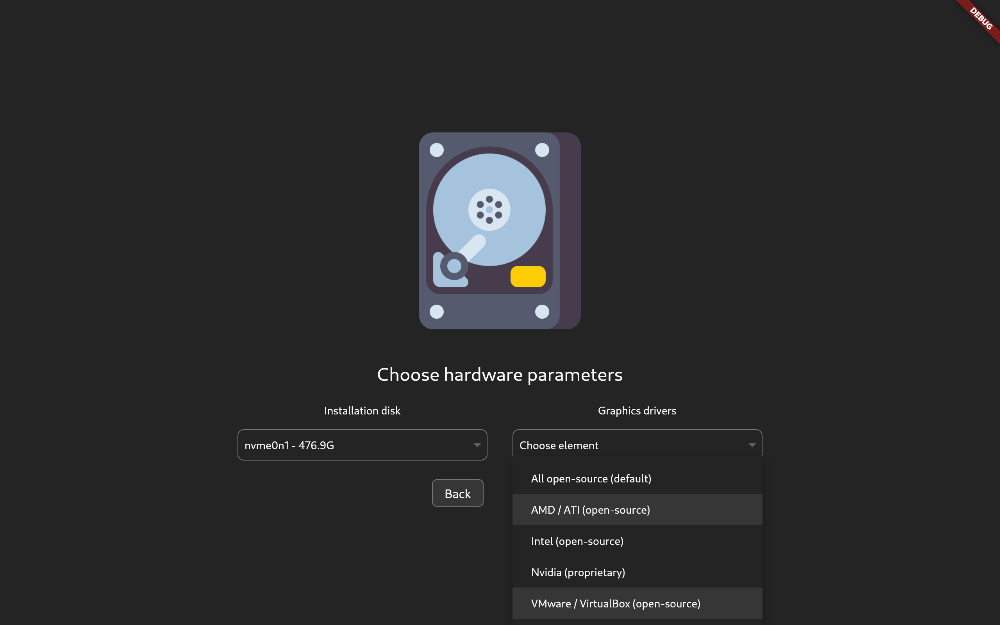
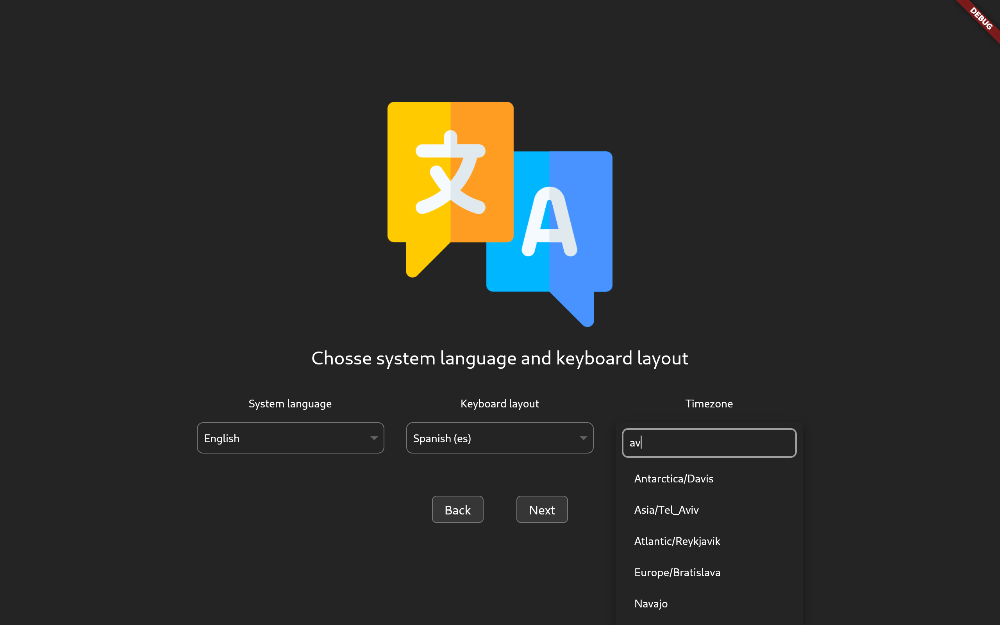

<h2 align="center">UI wrapper over archintall utility styled as gnome app</h2>

UI wrapper over archinstall utility styled to suite gnome applications. Installer is
in alpha stage and providing only base functionality of archinstall, but can be
easily customized and completed with all required functionality. Program is
making system calls to archinstall and serves only as graphical representation
to provide more 'user-friendly' experience for installation process.

- Welcome screen

- Disk screen

- Langs screen

### Development.

First, you need to run this application on `arch` based linux distribution, and get
`archintall` utility.

<!--
TODO
add some adjustments for dev tools and other stuff
-->
